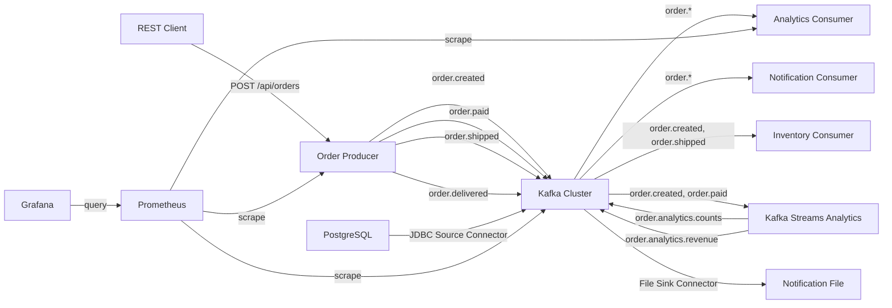

# Architecture Documentation

## Overview

EcommerceFlow is an event-driven microservices platform built on Apache Kafka for real-time e-commerce order processing. The architecture replaces a monolithic system with loosely coupled services that communicate via Kafka topics.

## Event Flow

## Topic Design

| Topic | Partitions | RF | Description |
|-------|-----------|-----|-------------|
| order.created | 6 | 3 | New order events |
| order.paid | 6 | 3 | Payment confirmation events |
| order.shipped | 6 | 3 | Shipment events |
| order.delivered | 6 | 3 | Delivery confirmation events |
| order.dlq | 3 | 3 | Dead letter queue for failed processing |
| order.analytics.counts | 3 | 3 | Windowed order count aggregations |
| order.analytics.revenue | 3 | 3 | Windowed revenue aggregations |
| customers | 3 | 3 | Customer data (JDBC Source Connector) |
| notifications | 3 | 3 | Notification messages (File Sink Connector) |

### Partitioning Strategy
- Order topics use `orderId` as partition key → guarantees ordering per order
- 6 partitions allow scaling consumers up to 6 instances per group
- Replication factor 3 with min.insync.replicas=2 ensures fault tolerance

## Consumer Groups

| Group ID | Service | Subscribed Topics |
|----------|---------|-------------------|
| analytics-group | Analytics Consumer | order.created, order.paid, order.shipped, order.delivered |
| notification-group | Notification Consumer | order.created, order.paid, order.shipped, order.delivered |
| inventory-group | Inventory Consumer | order.created, order.shipped |

## Kafka Streams Topology

The Kafka Streams application (`kafka-streams-analytics`) implements:

1. **Tumbling Window: Order Count per Hour** — Counts orders in 1-hour windows, writes to `order.analytics.counts`
2. **Per-Product Order Count** — Counts orders per product in 1-hour windows (materialized state store)
3. **Revenue Aggregation per Hour** — Sums payment amounts in 1-hour windows from `order.paid`, writes to `order.analytics.revenue`
4. **KStream-KTable Join** — Enriches `order.created` events with customer data from the `customers` KTable

## Security Architecture

- **Encryption:** SSL/TLS for broker-to-broker and client-to-broker communication
- **Authentication:** SASL/SCRAM for client authentication
- **Authorization:** ACL-based access control per topic and consumer group
- **Client Quotas:** Configurable to prevent resource exhaustion

## Error Handling

- **DLQ Pattern:** Failed messages after 3 retries are forwarded to `order.dlq`
- **Producer Idempotence:** `enable.idempotence=true` prevents duplicate messages
- **Manual Offset Commit:** Consumers only commit after successful processing
- **Consumer Retry:** FixedBackOff(1000ms, 3 attempts) before DLQ
